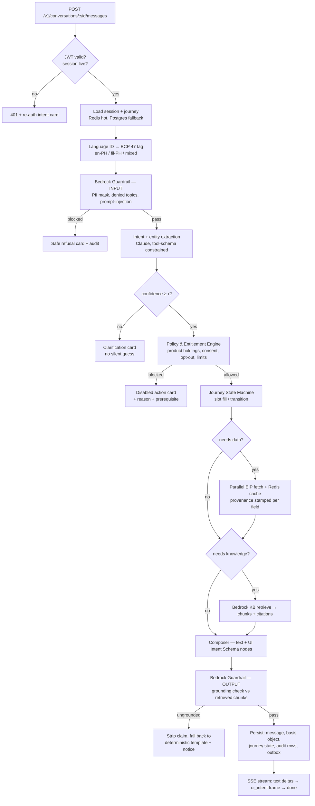
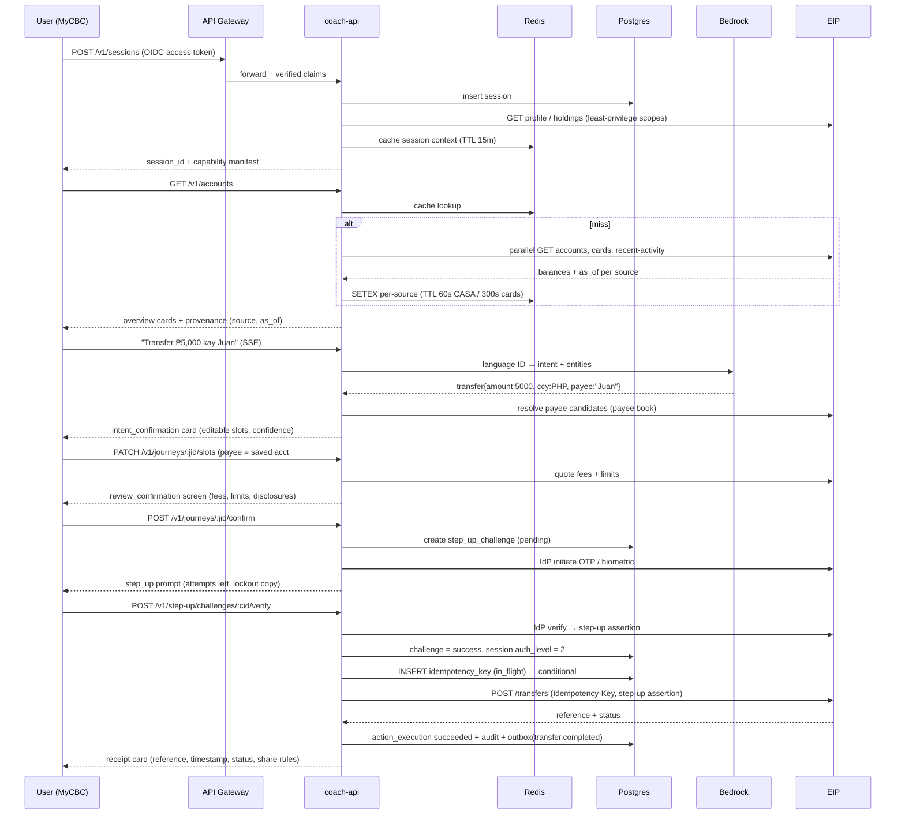
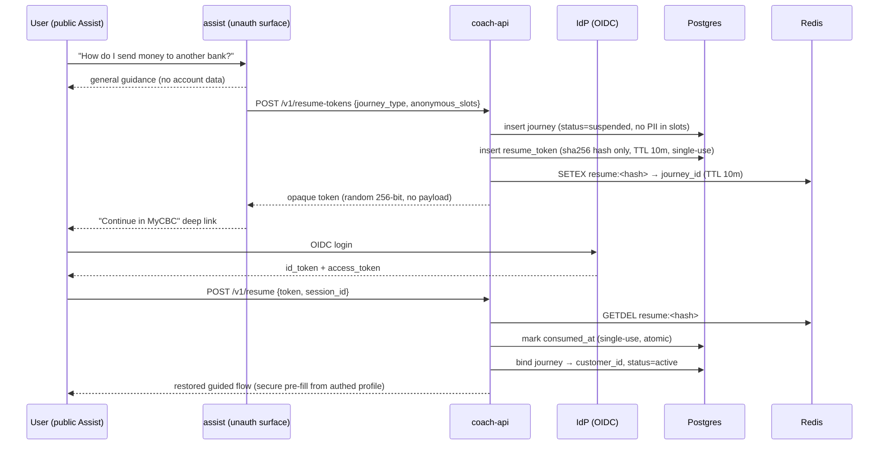
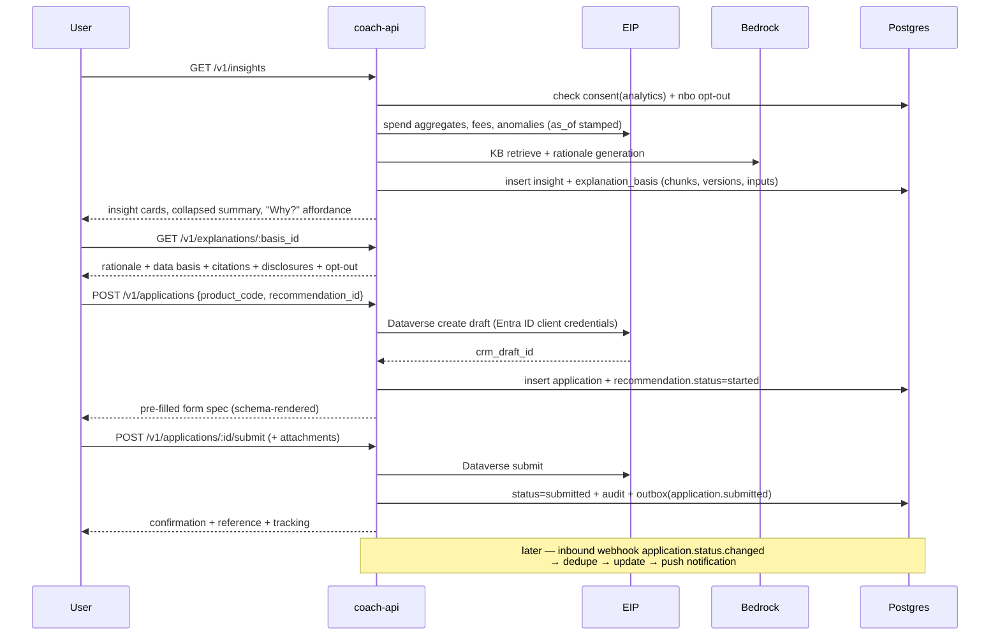
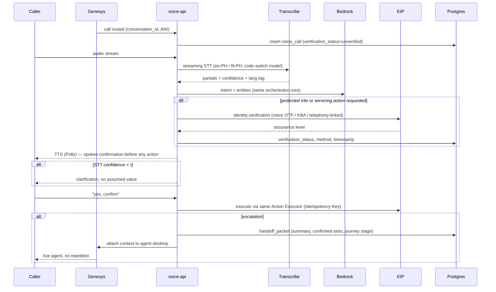

# FINAL_PLAN.md — CAI Coach (Module B) + CCC Voice AI (Module C)

---

## 1. Tech and tools

| Area                  | Decision                                                                                                                                                                                                   | Replaces (from BRIEF/PLAN)                                                                                   |
| --------------------- | ---------------------------------------------------------------------------------------------------------------------------------------------------------------------------------------------------------- | ------------------------------------------------------------------------------------------------------------ |
| Front-end integration | Coach backend returns **UI Intent Schema** JSON; MyCBC renders with CBC-owned Backbase components. We ship the schema, the OpenAPI contract, a renderer conformance suite, and Figma↔schema token mapping. | Hybrid with thin embeddable conversation shell — dropped. Conversation panel is also schema-rendered by CBC. |
| Backend               | FastAPI (async), one codebase, two deployment units (`coach-api`, `voice-api`) sharing the orchestrator core package                                                                                       | —                                                                                                            |
| AI                    | Bedrock: Claude models (intent/entity/compose/rationale), Bedrock Guardrails (grounding + PII + denied topics), Bedrock Knowledge Bases with **Aurora PostgreSQL + pgvector** as the vector store          | OpenSearch Serverless — dropped                                                                              |
| Primary datastore     | PostgreSQL (Aurora PostgreSQL 16, `pgvector`, `pgcrypto`, `pg_partman`)                                                                                                                                    | DynamoDB idempotency — dropped, moved to Postgres                                                            |
| State / cache / bus   | Redis (ElastiCache): session + journey hot state, resume-token index, response cache, rate limits, SSE fan-out, **Redis Streams** for internal async consumers                                             | EventBridge + SQS — dropped                                                                                  |
| Outbound events       | Postgres **transactional outbox** → relay → Redis Streams (internal) + signed HTTP webhooks (external), CloudEvents 1.0 envelope                                                                           | —                                                                                                            |
| Identity              | Direct OIDC to CBC IdP (no Cognito broker). Entra ID / MSAL client-credentials leg retained for Dataverse/D365 only.                                                                                       | Cognito — dropped                                                                                            |
| Voice I/O             | Amazon Transcribe (streaming STT) + Amazon Polly (TTS) as channel adapters; dialogue logic stays in the shared orchestrator                                                                                | —                                                                                                            |
| Compute               | ECS Fargate, ALB, per-service autoscaling                                                                                                                                                                  | —                                                                                                            |
| Archive               | S3 + Object Lock for audit/transcript retention beyond the online window                                                                                                                                   | —                                                                                                            |

**Boundary rule:** Coach never calls Core Banking / Cards / Payments / CRM directly. Every call goes through the CBC EIP gateway. The LLM never emits an executable call — it emits a _proposed action_, and only the Action Executor (deterministic Python, no model in the path) issues the EIP request after policy + confirmation + step-up checks pass.

---

## 2. System Architecture

```
┌───────────────────────────────────────────────────────────────────────┐
│ MyCBC App — Backbase (iOS / Android / optional Web)                    │
│  • Schema Renderer: UI Intent Schema v1 → Backbase components          │
│  • Launcher (FAB/tab/header), conversation thread, form renderer,      │
│    review screen, step-up prompt, receipt, "why" module, feedback      │
│  • SSE client for streaming turns                                      │
└───────────────┬───────────────────────────────────────────────────────┘
                │ HTTPS/TLS1.3 · OAuth2 · OIDC · JWT (DPoP-bound) · SSE
                ▼
┌───────────────────────────────────────────────────────────────────────┐
│ CBC API Gateway — authN/authZ edge, mTLS to backend, WAF, rate limit   │
└───────────────┬───────────────────────────────────────────────────────┘
                ▼
┌───────────────────────────────────────────────────────────────────────┐
│ coach-api  (FastAPI / Fargate)          voice-api (FastAPI / Fargate)  │
│ ┌───────────────────────────────────────────────────────────────────┐ │
│ │ shared orchestrator core (python package)                          │ │
│ │  Session Manager · Journey State Machine · NLU Layer ·             │ │
│ │  Policy & Entitlement Engine · Retrieval/Grounding · Composer ·    │ │
│ │  Explainability Logger · Action Executor · Copy/Locale Resolver     │ │
│ └───────────────────────────────────────────────────────────────────┘ │
│ channel adapters:  REST+SSE (app)        Genesys webhook + audio WS    │
└───┬──────────────┬──────────────┬───────────────┬────────────────────┘
    │              │              │               │
    ▼              ▼              ▼               ▼
┌────────┐   ┌──────────┐   ┌──────────┐   ┌──────────────────────────┐
│ Redis  │   │ Postgres │   │ Bedrock  │   │ EIP Gateway (CBC-owned)  │
│ hot    │   │ system   │   │ Claude   │   │ ├ Core Banking / Payments│
│ state  │   │ of record│   │ Guardrail│   │ ├ Core Cards             │
│ cache  │   │ audit    │   │ KB (RAG) │   │ ├ CRM Dataverse/D365     │
│ streams│   │ pgvector │   │          │   │ ├ IdP (OIDC + step-up)   │
└────────┘   └────┬─────┘   └──────────┘   │ └ ECMS / Knowledge repo  │
                  │                        └──────────────────────────┘
                  │ outbox relay
                  ▼
        Redis Streams (internal consumers) + signed webhooks (external)
        events: transfer.completed · application.status.changed ·
                nbo.campaign.triggered · card.status.changed
                  ▲
                  │ inbound webhooks (deduped, signature-verified)
        Genesys ──┘   Core Banking ──┘   D365 ──┘
```

---

## 3. Turn Pipeline (every conversational request)



Hard rule: nodes **F**, **M**, **N** are model calls; node **K** and all money movement are deterministic. A model output can never become an EIP call without passing **H**, an explicit user confirmation, and (for sensitive actions) a satisfied step-up challenge.

---

## 4. Sequence Flows

### Flow 1 — Account Overview → Transfer



Failure branches, all with defined UX: OTP wrong → re-prompt with remaining attempts; OTP locked → journey suspended + recovery card; EIP timeout → status `unknown`, receipt shows "verifying", reconciliation job polls and emits the terminal event; duplicate `Idempotency-Key` → replay stored response, no second debit.

### Flow 2 — Unauthenticated Assist → Authenticated Coach



Token properties: opaque random, never a JWT, no payload; only the SHA-256 is stored; single-use enforced by `UPDATE ... WHERE consumed_at IS NULL`; 10-minute TTL; bound to the issuing channel; journey state never leaves the backend.

### Flow 3 — Insights / NBO → Apply



Structural enforcement: the Apply and NBO composers cannot emit a `review_confirmation` node unless the required `disclosure` codes for that product resolve to a published, in-effect version in the requested locale. Missing disclosure = hard render error, not a skipped section.

### Flow C — Voice



Channel continuity: `voice_call.session_id` and `journey_id` point at the same journey rows the app uses, so a customer who starts on voice and opens MyCBC resumes the same state machine node.

---

## 5. UI Intent Schema (v1)

Single versioned envelope, `schema_version: "1.0"`, additive-only within a major version. One node type per B.7 inventory item.

```jsonc
{
    "schema_version": "1.0",
    "turn_id": "uuid",
    "journey_id": "uuid",
    "locale": "fil-PH",
    "speech": "Narito ang balanse mo.", // short spoken/read text
    "nodes": [
        /* discriminated union on "type" */
    ],
    "telemetry": { "intent": "account_overview", "confidence": 0.94 },
}
```

| `type`                | Purpose                 | Key fields                                                                                        |
| --------------------- | ----------------------- | ------------------------------------------------------------------------------------------------- |
| `text_block`          | Short narrative         | `body`, `emphasis`                                                                                |
| `intent_confirmation` | "You want to transfer…" | `slots[]` (editable, masked flags), `confidence`, `change_actions[]`                              |
| `action_card`         | CTA surface             | `title`, `actions[]`, `disabled_reason`, `prerequisites[]`                                        |
| `form_spec`           | Config-driven form      | `fields[]` (type, mask, validators, helper_key, error_keys), `presentation: inline\|sheet\|modal` |
| `review_confirmation` | Pre-execution review    | `line_items[]`, `fees[]`, `limits[]`, `disclosure_refs[]`, `friction: standard\|high`             |
| `step_up_prompt`      | Auth challenge          | `challenge_id`, `methods[]`, `attempts_remaining`, `fallback_key`, `lockout_key`                  |
| `receipt`             | Post-execution          | `reference`, `status`, `timestamp`, `share_policy`, `fields[]`                                    |
| `why_module`          | Explainability          | `basis_id`, `rationale`, `data_basis[]` (source, as_of), `citations[]`                            |
| `feedback_control`    | Rating / report         | `subject_type`, `subject_id`, `reason_codes[]`                                                    |
| `disclosure_block`    | Compliance copy         | `disclosure_code`, `version`, `locale`, `acknowledgement_required`                                |
| `provenance_badge`    | Data freshness          | `source_system`, `as_of`, `staleness_state`                                                       |

Every rendered string is a **copy key**, never literal text — the renderer resolves key + locale, or the backend inlines the resolved string with the key retained for audit. Confirmation policy is data, not code: `review_confirmation.friction` and `action_card.confirmation_mode` come from a policy table (`high-risk → modal`, `low-risk → snackbar`) that product and engineering own jointly and can change without a release.

Governance: schema in a versioned repo, JSON Schema published in the OpenAPI `components`, renderer conformance suite (golden payload → expected rendered tree) runs in CBC's mobile CI and ours.

---

## 6. API Surface (contract-first — OpenAPI 3.1 generated from Pydantic, spec merged before implementation)

| Method              | Path                                                | Notes                                                                                               |
| ------------------- | --------------------------------------------------- | --------------------------------------------------------------------------------------------------- |
| POST                | `/v1/sessions`                                      | creates session, returns capability manifest + consent state                                        |
| DELETE              | `/v1/sessions/{sid}`                                | ends session, flushes hot state                                                                     |
| POST                | `/v1/conversations/{sid}/messages`                  | `text/event-stream`; deltas then `ui_intent` frame                                                  |
| POST                | `/v1/conversations/{sid}/messages/{mid}/retry`      | re-run turn, same journey node                                                                      |
| PATCH               | `/v1/journeys/{jid}/slots`                          | entity correction, re-renders without restart                                                       |
| POST                | `/v1/journeys/{jid}/confirm`                        | advances to execution gate                                                                          |
| GET                 | `/v1/journeys/{jid}`                                | resume state for continuity                                                                         |
| GET                 | `/v1/accounts`                                      | consolidated overview + provenance                                                                  |
| GET                 | `/v1/accounts/{ref}/transactions`                   | cursor paginated                                                                                    |
| GET                 | `/v1/insights`                                      | insight cards + `basis_id` per card                                                                 |
| POST                | `/v1/insights/{id}/dismiss`                         |                                                                                                     |
| GET                 | `/v1/explanations/{basis_id}`                       | rationale, data basis, citations                                                                    |
| POST                | `/v1/transfers`                                     | `Idempotency-Key` required, step-up assertion required                                              |
| POST                | `/v1/bill-payments`                                 | as above                                                                                            |
| POST                | `/v1/cards/{ref}/lock` · `/unlock`                  | `Idempotency-Key`, step-up required                                                                 |
| GET                 | `/v1/cards/applications/{id}`                       | status inquiry                                                                                      |
| GET                 | `/v1/recommendations`                               | NBO, suppressed when opted out                                                                      |
| POST                | `/v1/recommendations/{id}/opt-out`                  | persisted state, not UI toggle                                                                      |
| POST · PATCH · POST | `/v1/applications` · `/{id}` · `/{id}/submit`       | draft, save/resume, submit                                                                          |
| GET · POST · PATCH  | `/v1/goals`                                         | financial coaching                                                                                  |
| POST                | `/v1/step-up/challenges` · `/{cid}/verify`          | reusable, interruptible                                                                             |
| POST                | `/v1/resume-tokens` · `/v1/resume`                  | Assist → Coach continuity                                                                           |
| GET · POST          | `/v1/consents`                                      | scoped consent capture + query                                                                      |
| POST                | `/v1/feedback`                                      | routes to analytics + KB ops                                                                        |
| POST                | `/v1/service-requests`                              | disputes / complaints                                                                               |
| POST                | `/v1/voice/calls` · `/{id}/turns` · `/{id}/handoff` | Genesys-facing                                                                                      |
| —                   | `webhooks:` section                                 | `transfer.completed`, `application.status.changed`, `card.status.changed`, `nbo.campaign.triggered` |

Every response carries `X-Request-Id`, `X-Trace-Id`; errors use RFC 9457 `application/problem+json` with a `copy_key` so the client renders localized, non-leaking messages.

Event envelope (CloudEvents 1.0):

```json
{
    "specversion": "1.0",
    "type": "ph.cbc.coach.transfer.completed",
    "source": "/coach/action-executor",
    "id": "uuid",
    "time": "2026-09-08T02:11:04Z",
    "subject": "journey/<uuid>",
    "datacontenttype": "application/json",
    "dataschema": "https://.../transfer.completed/1.0",
    "data": {}
}
```

Outbound webhooks: HMAC-SHA256 signature + timestamp, at-least-once, exponential backoff (1s→2s→4s→…→1h, 12 attempts), dead-letter table, consumer dedupe on `id`.

---

## 7. Redis Key Model

| Key                         | Type          | TTL           | Contents                                                     |
| --------------------------- | ------------- | ------------- | ------------------------------------------------------------ |
| `sess:{session_id}`         | hash          | 15m sliding   | auth_level, customer_id, locale, entitlements, consent flags |
| `jrny:{journey_id}`         | hash          | 30m sliding   | state node, slots, last turn id, schema_version              |
| `jrny:idx:{customer_id}`    | zset          | 24h           | active journeys by `updated_at` for resume                   |
| `draft:{journey_id}:form`   | string (json) | 30m           | in-progress form values, never contains full PAN/OTP         |
| `resume:{token_hash}`       | string        | 10m           | journey_id, single-use, `GETDEL`                             |
| `acct:{customer_id}:casa`   | string (json) | 60s           | balances + `as_of`                                           |
| `acct:{customer_id}:cards`  | string (json) | 300s          | card list + status                                           |
| `kb:{query_hash}:{locale}`  | string (json) | 10m           | retrieval results + citations                                |
| `copy:{locale}:{version}`   | hash          | 1h            | published copy strings                                       |
| `idem:lock:{key_hash}`      | string        | 60s           | `SET NX` in-flight guard ahead of the Postgres row           |
| `stepup:{challenge_id}`     | hash          | challenge TTL | attempts, method, nonce                                      |
| `rl:{customer_id}:{window}` | string        | window        | token bucket per customer + per endpoint class               |
| `sse:{session_id}`          | pub/sub       | —             | fan-out of turn frames across Fargate tasks                  |
| `stream:coach.events`       | stream        | maxlen 1M     | internal consumers: telemetry, NBO tracking, notifications   |
| `stream:coach.dlq`          | stream        | 30d           | poisoned messages                                            |

Redis is a cache and a hot-state tier only. Every value in it is reconstructable from Postgres; a full Redis flush degrades latency, never correctness.

---

## 8. PostgreSQL Schema

Extensions: `pgcrypto`, `pgvector`, `pg_partman`, `pg_stat_statements`, `btree_gin`.
Schemas: `coach` (operational), `audit` (append-only, no UPDATE/DELETE grants), `kb` (Bedrock KB-managed vector store), `content` (copy + disclosures).

### 8.1 Identity, session, journey

```sql
CREATE TABLE coach.customer (
  customer_id       uuid PRIMARY KEY DEFAULT gen_random_uuid(),
  idp_subject       text NOT NULL,
  segment           text,
  locale            text NOT NULL DEFAULT 'en-PH',
  accessibility_prefs jsonb NOT NULL DEFAULT '{}',
  created_at        timestamptz NOT NULL DEFAULT now(),
  updated_at        timestamptz NOT NULL DEFAULT now()
);
CREATE UNIQUE INDEX customer_idp_subject_uq ON coach.customer (idp_subject);

CREATE TABLE coach.session (
  session_id     uuid PRIMARY KEY,
  customer_id    uuid NOT NULL REFERENCES coach.customer,
  channel        text NOT NULL CHECK (channel IN ('app','web','voice')),
  device_ref     text,
  locale         text NOT NULL,
  auth_level     smallint NOT NULL DEFAULT 1 CHECK (auth_level BETWEEN 0 AND 2),
  step_up_expires_at timestamptz,
  started_at     timestamptz NOT NULL DEFAULT now(),
  last_seen_at   timestamptz NOT NULL DEFAULT now(),
  ended_at       timestamptz
);
CREATE INDEX session_customer_started_idx ON coach.session (customer_id, started_at DESC);
CREATE INDEX session_live_idx ON coach.session (last_seen_at) WHERE ended_at IS NULL;

CREATE TABLE coach.journey (
  journey_id     uuid PRIMARY KEY,
  customer_id    uuid REFERENCES coach.customer,
  session_id     uuid REFERENCES coach.session,
  journey_type   text NOT NULL,
  state          text NOT NULL,
  status         text NOT NULL DEFAULT 'active'
                 CHECK (status IN ('active','suspended','completed','abandoned','failed')),
  slots          jsonb NOT NULL DEFAULT '{}',
  origin_channel text NOT NULL,
  schema_version text NOT NULL,
  resumable_until timestamptz,
  created_at     timestamptz NOT NULL DEFAULT now(),
  updated_at     timestamptz NOT NULL DEFAULT now(),
  completed_at   timestamptz
);
CREATE INDEX journey_customer_active_idx ON coach.journey (customer_id, updated_at DESC)
  WHERE status IN ('active','suspended');
CREATE INDEX journey_session_idx  ON coach.journey (session_id);
CREATE INDEX journey_type_status_idx ON coach.journey (journey_type, status, created_at DESC);
CREATE INDEX journey_slots_gin ON coach.journey USING gin (slots jsonb_path_ops);
CREATE INDEX journey_resume_sweep_idx ON coach.journey (resumable_until)
  WHERE status = 'suspended';

CREATE TABLE coach.journey_transition (
  transition_id bigserial PRIMARY KEY,
  journey_id    uuid NOT NULL REFERENCES coach.journey,
  from_state    text,
  to_state      text NOT NULL,
  trigger       text NOT NULL,
  actor         text NOT NULL,
  occurred_at   timestamptz NOT NULL DEFAULT now()
);
CREATE INDEX journey_transition_journey_idx ON coach.journey_transition (journey_id, occurred_at);
```

### 8.2 Conversation

```sql
CREATE TABLE coach.message (
  message_id      uuid PRIMARY KEY,
  session_id      uuid NOT NULL REFERENCES coach.session,
  journey_id      uuid REFERENCES coach.journey,
  turn_index      integer NOT NULL,
  role            text NOT NULL CHECK (role IN ('user','assistant','system','tool')),
  content_text    text,
  ui_intent       jsonb,
  lang_tag        text,
  lang_confidence numeric(4,3),
  intent          text,
  intent_confidence numeric(4,3),
  entities        jsonb,
  guardrail       jsonb,
  edited_of       uuid REFERENCES coach.message,
  created_at      timestamptz NOT NULL DEFAULT now()
);
CREATE UNIQUE INDEX message_session_turn_uq ON coach.message (session_id, turn_index);
CREATE INDEX message_journey_idx ON coach.message (journey_id, created_at);
CREATE INDEX message_intent_idx  ON coach.message (intent, created_at DESC) WHERE intent IS NOT NULL;
CREATE INDEX message_lang_idx    ON coach.message (lang_tag, created_at DESC);
```

### 8.3 Security — step-up, resume tokens, idempotency

```sql
CREATE TABLE coach.step_up_challenge (
  challenge_id   uuid PRIMARY KEY,
  session_id     uuid NOT NULL REFERENCES coach.session,
  journey_id     uuid REFERENCES coach.journey,
  customer_id    uuid NOT NULL REFERENCES coach.customer,
  method         text NOT NULL CHECK (method IN ('otp_sms','otp_email','biometric','voice_otp','kba')),
  status         text NOT NULL DEFAULT 'pending'
                 CHECK (status IN ('pending','success','failed','expired','locked')),
  attempts       smallint NOT NULL DEFAULT 0,
  max_attempts   smallint NOT NULL DEFAULT 3,
  pending_action jsonb NOT NULL,
  provider_ref   text,
  expires_at     timestamptz NOT NULL,
  created_at     timestamptz NOT NULL DEFAULT now(),
  resolved_at    timestamptz
);
CREATE INDEX stepup_pending_idx ON coach.step_up_challenge (expires_at) WHERE status = 'pending';
CREATE INDEX stepup_customer_idx ON coach.step_up_challenge (customer_id, created_at DESC);
CREATE INDEX stepup_lockout_idx ON coach.step_up_challenge (customer_id, resolved_at DESC)
  WHERE status IN ('failed','locked');

CREATE TABLE coach.resume_token (
  token_hash      bytea PRIMARY KEY,
  journey_id      uuid NOT NULL REFERENCES coach.journey,
  issuing_channel text NOT NULL,
  issued_at       timestamptz NOT NULL DEFAULT now(),
  expires_at      timestamptz NOT NULL,
  consumed_at     timestamptz,
  consumed_by_session uuid REFERENCES coach.session
);
CREATE INDEX resume_token_live_idx ON coach.resume_token (expires_at) WHERE consumed_at IS NULL;
CREATE INDEX resume_token_journey_idx ON coach.resume_token (journey_id);

CREATE TABLE coach.idempotency_key (
  customer_id   uuid NOT NULL,
  endpoint      text NOT NULL,
  idem_key      text NOT NULL,
  request_hash  bytea NOT NULL,
  status        text NOT NULL CHECK (status IN ('in_flight','succeeded','failed')),
  response_code integer,
  response_body jsonb,
  action_id     uuid,
  created_at    timestamptz NOT NULL DEFAULT now(),
  expires_at    timestamptz NOT NULL,
  PRIMARY KEY (customer_id, endpoint, idem_key)
);
CREATE INDEX idem_expiry_idx ON coach.idempotency_key (expires_at);
CREATE INDEX idem_action_idx ON coach.idempotency_key (action_id) WHERE action_id IS NOT NULL;
```

Executor contract:

```sql
INSERT INTO coach.idempotency_key (customer_id, endpoint, idem_key, request_hash, status, expires_at)
VALUES ($1,$2,$3,$4,'in_flight', now() + interval '24 hours')
ON CONFLICT (customer_id, endpoint, idem_key) DO NOTHING
RETURNING 1;
```

No row returned → same key seen before: if `request_hash` differs return 422, if `status='in_flight'` return 409 with retry-after, otherwise replay the stored response.

### 8.4 Actions and money movement

```sql
CREATE TABLE coach.action_execution (
  action_id       uuid PRIMARY KEY,
  journey_id      uuid REFERENCES coach.journey,
  customer_id     uuid NOT NULL REFERENCES coach.customer,
  action_type     text NOT NULL
                  CHECK (action_type IN ('transfer','bill_pay','card_lock','card_unlock','application_submit','dispute_file')),
  amount          numeric(18,2),
  currency        char(3),
  request_payload jsonb NOT NULL,
  eip_endpoint    text NOT NULL,
  downstream_ref  text,
  status          text NOT NULL DEFAULT 'pending'
                  CHECK (status IN ('pending','submitted','succeeded','failed','reversed','unknown')),
  step_up_challenge_id uuid REFERENCES coach.step_up_challenge,
  attempt         smallint NOT NULL DEFAULT 1,
  error           jsonb,
  created_at      timestamptz NOT NULL DEFAULT now(),
  submitted_at    timestamptz,
  settled_at      timestamptz
);
CREATE UNIQUE INDEX action_downstream_ref_uq ON coach.action_execution (downstream_ref)
  WHERE downstream_ref IS NOT NULL;
CREATE INDEX action_customer_idx ON coach.action_execution (customer_id, created_at DESC);
CREATE INDEX action_reconcile_idx ON coach.action_execution (status, submitted_at)
  WHERE status IN ('pending','submitted','unknown');
CREATE INDEX action_journey_idx ON coach.action_execution (journey_id);
CREATE INDEX action_type_day_idx ON coach.action_execution (action_type, created_at DESC);
```

Constraint: `step_up_challenge_id IS NOT NULL` enforced by trigger for `action_type IN ('transfer','bill_pay','card_lock','card_unlock')`.

### 8.5 Insights, explainability, NBO, coaching

```sql
CREATE TABLE coach.explanation_basis (
  basis_id       uuid PRIMARY KEY,
  subject_type   text NOT NULL CHECK (subject_type IN ('insight','recommendation','answer','coaching_nudge')),
  subject_id     uuid,
  customer_id    uuid REFERENCES coach.customer,
  journey_id     uuid REFERENCES coach.journey,
  model_id       text NOT NULL,
  prompt_hash    bytea NOT NULL,
  inputs         jsonb NOT NULL,     -- data points + source_system + as_of
  retrieved      jsonb NOT NULL,     -- [{doc_id, doc_version, chunk_id, score, uri}]
  rationale      text NOT NULL,
  guardrail      jsonb NOT NULL,     -- grounding verdict, coverage score, actions
  created_at     timestamptz NOT NULL DEFAULT now()
);
CREATE INDEX basis_subject_idx  ON coach.explanation_basis (subject_type, subject_id);
CREATE INDEX basis_customer_idx ON coach.explanation_basis (customer_id, created_at DESC);
CREATE INDEX basis_retrieved_gin ON coach.explanation_basis USING gin (retrieved jsonb_path_ops);
CREATE INDEX basis_model_idx ON coach.explanation_basis (model_id, created_at DESC);

CREATE TABLE coach.insight (
  insight_id    uuid PRIMARY KEY,
  customer_id   uuid NOT NULL REFERENCES coach.customer,
  insight_type  text NOT NULL,
  period_start  date, period_end date,
  value         numeric(18,2), currency char(3),
  headline_key  text NOT NULL,
  payload       jsonb NOT NULL,
  provenance    jsonb NOT NULL,      -- [{field, source_system, as_of}]
  basis_id      uuid REFERENCES coach.explanation_basis,
  generated_at  timestamptz NOT NULL DEFAULT now(),
  expires_at    timestamptz,
  dismissed_at  timestamptz
);
CREATE INDEX insight_customer_feed_idx ON coach.insight (customer_id, generated_at DESC)
  WHERE dismissed_at IS NULL;
CREATE INDEX insight_type_idx ON coach.insight (insight_type, generated_at DESC);
CREATE INDEX insight_expiry_idx ON coach.insight (expires_at) WHERE expires_at IS NOT NULL;

CREATE TABLE coach.recommendation (
  recommendation_id uuid PRIMARY KEY,
  customer_id     uuid NOT NULL REFERENCES coach.customer,
  campaign_id     text NOT NULL,
  product_code    text NOT NULL,
  score           numeric(5,4),
  basis_id        uuid REFERENCES coach.explanation_basis,
  disclosure_version text NOT NULL,
  status          text NOT NULL DEFAULT 'offered'
                  CHECK (status IN ('offered','viewed','why_viewed','started','submitted','declined','suppressed')),
  suppressed_reason text,
  offered_at      timestamptz NOT NULL DEFAULT now(),
  last_status_at  timestamptz NOT NULL DEFAULT now(),
  application_id  uuid
);
CREATE UNIQUE INDEX reco_active_uq ON coach.recommendation (customer_id, campaign_id, product_code)
  WHERE status NOT IN ('declined','suppressed');
CREATE INDEX reco_customer_idx ON coach.recommendation (customer_id, offered_at DESC);
CREATE INDEX reco_funnel_idx   ON coach.recommendation (campaign_id, status, last_status_at DESC);

CREATE TABLE coach.goal (
  goal_id       uuid PRIMARY KEY,
  customer_id   uuid NOT NULL REFERENCES coach.customer,
  goal_type     text NOT NULL,
  target_amount numeric(18,2), target_date date,
  assumptions   jsonb NOT NULL DEFAULT '{}',
  status        text NOT NULL DEFAULT 'active',
  created_at timestamptz NOT NULL DEFAULT now(),
  updated_at timestamptz NOT NULL DEFAULT now()
);
CREATE INDEX goal_customer_idx ON coach.goal (customer_id, status, target_date);

CREATE TABLE coach.goal_progress (
  goal_id uuid NOT NULL REFERENCES coach.goal,
  as_of   date NOT NULL,
  amount  numeric(18,2) NOT NULL,
  source  text NOT NULL,
  PRIMARY KEY (goal_id, as_of)
);

CREATE TABLE coach.application (
  application_id uuid PRIMARY KEY,
  customer_id    uuid NOT NULL REFERENCES coach.customer,
  product_code   text NOT NULL,
  crm_draft_id   text,
  recommendation_id uuid REFERENCES coach.recommendation,
  status         text NOT NULL DEFAULT 'draft'
                 CHECK (status IN ('draft','submitted','in_review','approved','declined','withdrawn')),
  prefill        jsonb NOT NULL DEFAULT '{}',
  reference      text,
  tracking       jsonb,
  created_at timestamptz NOT NULL DEFAULT now(),
  updated_at timestamptz NOT NULL DEFAULT now(),
  submitted_at timestamptz
);
CREATE UNIQUE INDEX application_crm_draft_uq ON coach.application (crm_draft_id)
  WHERE crm_draft_id IS NOT NULL;
CREATE INDEX application_customer_idx ON coach.application (customer_id, updated_at DESC);
CREATE INDEX application_resume_idx ON coach.application (customer_id, updated_at DESC)
  WHERE status = 'draft';
```

### 8.6 Consent, feedback, service requests, privacy

```sql
CREATE TABLE coach.consent_event (
  consent_event_id bigserial PRIMARY KEY,
  customer_id  uuid NOT NULL REFERENCES coach.customer,
  scope        text NOT NULL,   -- coach_onboarding | analytics | nbo | voice_recording | transcript_retention
  granted      boolean NOT NULL,
  notice_version text NOT NULL,
  locale       text NOT NULL,
  source       text NOT NULL,   -- onboarding | settings | voice_ivr | agent
  evidence     jsonb NOT NULL,
  occurred_at  timestamptz NOT NULL DEFAULT now()
);
CREATE INDEX consent_event_customer_idx ON coach.consent_event (customer_id, scope, occurred_at DESC);

CREATE TABLE coach.consent_state (
  customer_id uuid NOT NULL REFERENCES coach.customer,
  scope       text NOT NULL,
  granted     boolean NOT NULL,
  notice_version text NOT NULL,
  updated_at  timestamptz NOT NULL DEFAULT now(),
  PRIMARY KEY (customer_id, scope)
);
CREATE INDEX consent_state_scope_idx ON coach.consent_state (scope, granted);

CREATE TABLE coach.feedback (
  feedback_id  uuid PRIMARY KEY,
  customer_id  uuid REFERENCES coach.customer,
  message_id   uuid REFERENCES coach.message,
  subject_type text NOT NULL, subject_id uuid,
  rating       smallint CHECK (rating IN (-1,1)),
  reason_code  text,
  correction   text,
  routed_to    text,
  created_at   timestamptz NOT NULL DEFAULT now()
);
CREATE INDEX feedback_subject_idx ON coach.feedback (subject_type, subject_id);
CREATE INDEX feedback_triage_idx  ON coach.feedback (reason_code, created_at DESC) WHERE rating = -1;

CREATE TABLE coach.service_request (
  request_id   uuid PRIMARY KEY,
  customer_id  uuid NOT NULL REFERENCES coach.customer,
  request_type text NOT NULL,   -- dispute | complaint | inquiry
  related_action_id uuid REFERENCES coach.action_execution,
  status       text NOT NULL DEFAULT 'open',
  crm_ref      text,
  sla_due_at   timestamptz,
  created_at   timestamptz NOT NULL DEFAULT now(),
  closed_at    timestamptz
);
CREATE INDEX sr_customer_idx ON coach.service_request (customer_id, created_at DESC);
CREATE INDEX sr_sla_idx ON coach.service_request (sla_due_at) WHERE closed_at IS NULL;

CREATE TABLE coach.privacy_incident (
  incident_id  uuid PRIMARY KEY,
  detected_at  timestamptz NOT NULL,
  severity     text NOT NULL,
  categories   jsonb NOT NULL,
  affected_count integer,
  npc_due_at   timestamptz GENERATED ALWAYS AS (detected_at + interval '72 hours') STORED,
  npc_notified_at timestamptz,
  subjects_notified_at timestamptz,
  status       text NOT NULL DEFAULT 'open',
  owner        text
);
CREATE INDEX incident_due_idx ON coach.privacy_incident (npc_due_at) WHERE npc_notified_at IS NULL;
```

### 8.7 Events

```sql
CREATE TABLE coach.event_outbox (
  event_id     uuid PRIMARY KEY,
  event_type   text NOT NULL,
  subject      text NOT NULL,
  data         jsonb NOT NULL,
  journey_id   uuid, customer_id uuid,
  status       text NOT NULL DEFAULT 'pending' CHECK (status IN ('pending','published','failed')),
  attempts     smallint NOT NULL DEFAULT 0,
  next_attempt_at timestamptz NOT NULL DEFAULT now(),
  created_at   timestamptz NOT NULL DEFAULT now(),
  published_at timestamptz
);
CREATE INDEX outbox_dispatch_idx ON coach.event_outbox (next_attempt_at, event_id)
  WHERE status <> 'published';

CREATE TABLE coach.inbound_event (
  provider     text NOT NULL,
  provider_event_id text NOT NULL,
  event_type   text NOT NULL,
  payload      jsonb NOT NULL,
  received_at  timestamptz NOT NULL DEFAULT now(),
  processed_at timestamptz,
  PRIMARY KEY (provider, provider_event_id)
);
CREATE INDEX inbound_unprocessed_idx ON coach.inbound_event (received_at) WHERE processed_at IS NULL;

CREATE TABLE coach.webhook_subscription (
  subscription_id uuid PRIMARY KEY,
  consumer     text NOT NULL,
  target_url   text NOT NULL,
  event_types  text[] NOT NULL,
  secret_ref   text NOT NULL,
  active       boolean NOT NULL DEFAULT true,
  created_at   timestamptz NOT NULL DEFAULT now()
);
CREATE INDEX webhook_sub_types_idx ON coach.webhook_subscription USING gin (event_types)
  WHERE active;

CREATE TABLE coach.webhook_delivery (
  delivery_id  bigserial PRIMARY KEY,
  subscription_id uuid NOT NULL REFERENCES coach.webhook_subscription,
  event_id     uuid NOT NULL,
  status       text NOT NULL DEFAULT 'pending',
  attempts     smallint NOT NULL DEFAULT 0,
  next_attempt_at timestamptz NOT NULL DEFAULT now(),
  last_status_code integer,
  last_error   text,
  created_at   timestamptz NOT NULL DEFAULT now(),
  delivered_at timestamptz
);
CREATE UNIQUE INDEX webhook_delivery_uq ON coach.webhook_delivery (subscription_id, event_id);
CREATE INDEX webhook_retry_idx ON coach.webhook_delivery (next_attempt_at)
  WHERE status IN ('pending','retrying');
```

### 8.8 Audit and telemetry (partitioned)

```sql
CREATE TABLE audit.audit_log (
  audit_id     bigint GENERATED ALWAYS AS IDENTITY,
  occurred_at  timestamptz NOT NULL,
  event_type   text NOT NULL,
  actor_type   text NOT NULL, actor_ref text,
  customer_id  uuid, session_id uuid, journey_id uuid,
  object_type  text, object_id text,
  payload      jsonb NOT NULL,
  prev_hash    bytea,
  row_hash     bytea NOT NULL,
  PRIMARY KEY (audit_id, occurred_at)
) PARTITION BY RANGE (occurred_at);
-- monthly partitions via pg_partman, 24 months online, S3 Object Lock beyond

CREATE INDEX audit_customer_idx ON audit.audit_log (customer_id, occurred_at DESC);
CREATE INDEX audit_type_idx     ON audit.audit_log (event_type, occurred_at DESC);
CREATE INDEX audit_journey_idx  ON audit.audit_log (journey_id, occurred_at);
CREATE INDEX audit_object_idx   ON audit.audit_log (object_type, object_id);
CREATE INDEX audit_payload_gin  ON audit.audit_log USING gin (payload jsonb_path_ops);
CREATE INDEX audit_time_brin    ON audit.audit_log USING brin (occurred_at) WITH (pages_per_range = 64);

REVOKE UPDATE, DELETE ON audit.audit_log FROM app_rw;
-- row_hash = sha256(prev_hash || canonical_json(row)); chain verified nightly

CREATE TABLE coach.model_invocation (
  invocation_id uuid NOT NULL,
  occurred_at   timestamptz NOT NULL,
  purpose       text NOT NULL,   -- lang_id | intent | rag_answer | rationale | voice_turn | summarize
  model_id      text NOT NULL,
  session_id    uuid, journey_id uuid,
  input_tokens  integer, output_tokens integer,
  latency_ms    integer, ttfb_ms integer,
  guardrail_action text,
  grounding_score numeric(4,3),
  stop_reason   text, error_code text,
  PRIMARY KEY (invocation_id, occurred_at)
) PARTITION BY RANGE (occurred_at);

CREATE INDEX mi_purpose_idx ON coach.model_invocation (purpose, occurred_at DESC);
CREATE INDEX mi_model_idx   ON coach.model_invocation (model_id, occurred_at DESC);
CREATE INDEX mi_guardrail_idx ON coach.model_invocation (guardrail_action, occurred_at DESC)
  WHERE guardrail_action <> 'NONE';
CREATE INDEX mi_time_brin ON coach.model_invocation USING brin (occurred_at);

CREATE TABLE coach.experiment_assignment (
  customer_id uuid NOT NULL REFERENCES coach.customer,
  experiment_key text NOT NULL,
  variant     text NOT NULL,
  assigned_at timestamptz NOT NULL DEFAULT now(),
  PRIMARY KEY (customer_id, experiment_key)
);
CREATE INDEX experiment_variant_idx ON coach.experiment_assignment (experiment_key, variant);
```

### 8.9 Knowledge base and content

```sql
CREATE TABLE kb.document (
  document_id  uuid PRIMARY KEY,
  ecms_ref     text NOT NULL,
  title        text NOT NULL,
  locale       text NOT NULL,
  version      integer NOT NULL,
  checksum     bytea NOT NULL,
  status       text NOT NULL CHECK (status IN ('ingesting','active','superseded','withdrawn')),
  effective_from timestamptz NOT NULL,
  effective_to   timestamptz,
  ingested_at  timestamptz NOT NULL DEFAULT now()
);
CREATE UNIQUE INDEX kb_document_version_uq ON kb.document (ecms_ref, version);
CREATE INDEX kb_document_active_idx ON kb.document (locale, effective_from DESC) WHERE status = 'active';

-- Bedrock Knowledge Base managed vector table (Aurora pgvector)
CREATE TABLE kb.chunk (
  chunk_id   uuid PRIMARY KEY,
  document_id uuid NOT NULL REFERENCES kb.document,
  ordinal    integer NOT NULL,
  content    text NOT NULL,
  embedding  vector(1024) NOT NULL,
  metadata   jsonb NOT NULL
);
CREATE INDEX kb_chunk_hnsw ON kb.chunk USING hnsw (embedding vector_cosine_ops)
  WITH (m = 16, ef_construction = 64);
CREATE INDEX kb_chunk_doc_idx ON kb.chunk (document_id, ordinal);
CREATE INDEX kb_chunk_meta_gin ON kb.chunk USING gin (metadata jsonb_path_ops);

CREATE TABLE content.copy_string (
  copy_key   text NOT NULL,
  locale     text NOT NULL,
  version    integer NOT NULL,
  body       text NOT NULL,
  status     text NOT NULL CHECK (status IN ('draft','approved','published','retired')),
  approved_by text, published_at timestamptz,
  PRIMARY KEY (copy_key, locale, version)
);
CREATE UNIQUE INDEX copy_published_uq ON content.copy_string (copy_key, locale)
  WHERE status = 'published';

CREATE TABLE content.disclosure (
  disclosure_code text NOT NULL,
  locale     text NOT NULL,
  version    integer NOT NULL,
  body       text NOT NULL,
  required_for jsonb NOT NULL,   -- {"product_codes":[...], "journeys":[...]}
  effective_from timestamptz NOT NULL,
  effective_to   timestamptz,
  PRIMARY KEY (disclosure_code, locale, version)
);
CREATE INDEX disclosure_effective_idx ON content.disclosure (disclosure_code, locale, effective_from DESC);
CREATE INDEX disclosure_required_gin ON content.disclosure USING gin (required_for jsonb_path_ops);
```

### 8.10 Voice

```sql
CREATE TABLE coach.voice_call (
  call_id      uuid PRIMARY KEY,
  genesys_conversation_id text NOT NULL,
  session_id   uuid REFERENCES coach.session,
  customer_id  uuid REFERENCES coach.customer,
  ani_hash     bytea,
  verification_status text NOT NULL DEFAULT 'unverified'
               CHECK (verification_status IN ('unverified','in_progress','verified','failed')),
  verification_method text,
  started_at   timestamptz NOT NULL DEFAULT now(),
  ended_at     timestamptz,
  handoff_at   timestamptz,
  agent_ref    text,
  disposition  text
);
CREATE UNIQUE INDEX voice_call_genesys_uq ON coach.voice_call (genesys_conversation_id);
CREATE INDEX voice_call_customer_idx ON coach.voice_call (customer_id, started_at DESC);
CREATE INDEX voice_call_live_idx ON coach.voice_call (started_at DESC) WHERE ended_at IS NULL;

CREATE TABLE coach.voice_turn (
  turn_id     uuid PRIMARY KEY,
  call_id     uuid NOT NULL REFERENCES coach.voice_call,
  ordinal     integer NOT NULL,
  direction   text NOT NULL CHECK (direction IN ('inbound','outbound')),
  transcript_redacted text NOT NULL,
  stt_confidence numeric(4,3),
  lang_tag    text,
  intent      text,
  duration_ms integer,
  started_at  timestamptz NOT NULL
);
CREATE UNIQUE INDEX voice_turn_ordinal_uq ON coach.voice_turn (call_id, ordinal);
CREATE INDEX voice_turn_lowconf_idx ON coach.voice_turn (call_id) WHERE stt_confidence < 0.70;

CREATE TABLE coach.handoff_packet (
  call_id     uuid PRIMARY KEY REFERENCES coach.voice_call,
  journey_id  uuid REFERENCES coach.journey,
  summary     text NOT NULL,
  confirmed_slots jsonb NOT NULL,
  journey_stage text,
  delivered_at timestamptz,
  agent_ack_at timestamptz
);
```

**Storage rules:** raw audio is never written to Postgres — S3 with KMS, lifecycle-expired per the `voice_recording` consent scope. Only redacted transcripts persist. Card PANs, OTPs, and full account numbers are never stored; masked forms only, with `pgcrypto` column encryption on `ani_hash` and any residual identifiers.

---

## 5+8 note on partitioning and maintenance

`audit.audit_log` and `coach.model_invocation` are monthly range partitions managed by `pg_partman` (retention: 24 months and 13 months online). `coach.message` and `coach.voice_turn` are partitioned monthly once volume exceeds 50M rows. `coach.idempotency_key`, `coach.resume_token`, and expired `coach.journey` rows are swept hourly by a background task. Autovacuum is tuned per high-churn table (`session`, `journey`, `idempotency_key`) with `autovacuum_vacuum_scale_factor = 0.02`.

Read replicas: one for analytics/drift dashboards, one for compliance/audit queries. Application reads for insights aggregation route to a replica; anything in a money-movement path reads primary.

---

## 9. Latency, Reliability, Provenance

| Concern                    | Approach                                                                                                                                              | Target                               |
| -------------------------- | ----------------------------------------------------------------------------------------------------------------------------------------------------- | ------------------------------------ |
| Account overview           | `asyncio.gather` across CASA/cards/activity via EIP, per-source Redis TTL, partial render on one-source failure                                       | p95 ≤ 1.2s                           |
| First token of a chat turn | Streaming Bedrock invoke, guardrail on input only before first token, output guardrail buffered per sentence                                          | p95 TTFB ≤ 900ms                     |
| Action execution           | Deterministic path, no model call                                                                                                                     | p95 ≤ 2.5s excluding EIP             |
| Downstream failure         | Circuit breaker per EIP route, bulkhead pools, budgeted retries (idempotent GETs only)                                                                | no cascading timeout                 |
| Stale data                 | Every numeric field carries `{source_system, as_of}`; renderer shows `provenance_badge` when `now - as_of` exceeds the per-source freshness threshold | never present stale as authoritative |
| Partial data               | Overview renders the sources that answered plus an explicit "couldn't load cards" block with retry action                                             | no silent gaps                       |
| Error UX                   | Every orchestration step maps to a `problem+json` type → `copy_key` → localized card; raw upstream errors never reach the client                      | no raw leakage                       |
| Unknown transaction state  | `action_execution.status='unknown'` + reconciliation worker polling EIP; receipt shows "verifying", resolves via webhook or poll                      | no phantom success                   |

---

## 10. Security & Identity

- OIDC authorization code + PKCE between MyCBC and CBC IdP; access tokens are sender-constrained (DPoP or mTLS-bound). Coach validates signature, `aud`, `azp`, `exp`, and required scopes on every request; JWKS cached with rotation.
- Scope model is per-journey and least-privilege: `coach.accounts.read`, `coach.transfers.write`, `coach.cards.manage`, `coach.crm.applications.write`. The session context loads only fields the active journey needs; the model prompt receives a **projected, masked** view (masked account numbers, no full PAN, no identifiers beyond what the turn requires).
- Step-up: `auth_level=2` with a bounded validity window (`step_up_expires_at`, default 5 minutes, single-action binding via `pending_action`). Challenges are interruptible — the journey suspends and resumes at the same state node on success, failure, or lockout.
- Entra ID / MSAL client-credentials flow for Dataverse; token cached in Redis under a service-scoped key, never in customer session state.
- Secrets in AWS Secrets Manager, envelope encryption via KMS; resume-token pepper, webhook HMAC secrets, and audit-chain keys rotate on schedule.
- Prompt-injection defense: retrieved KB content and any customer-supplied text are passed as data-tagged blocks; tool/action schemas are closed enumerations; the executor validates the proposed action against the journey's allowed transitions before it will call EIP.

---

## 11. Grounding, Explainability, Governance

- Bedrock Guardrails configured once per environment: denied topics (unlicensed financial advice, guarantees of returns, competitor claims), PII filters, contextual grounding threshold on retrieved chunks. Applied on input and output.
- Output that fails the grounding check does not reach the user — the composer falls back to a deterministic template built from EIP data only, and the drop is recorded in `model_invocation.guardrail_action`.
- Every insight, recommendation, KB answer, and coaching nudge writes an `explanation_basis` row in the same transaction as the artifact. `GET /v1/explanations/{basis_id}` is the audit and UI read path — B-AT-04's 20-recommendation sample is a single query.
- AI RMF cadence: govern (model registry + change approval), measure (drift dashboards from `model_invocation` + `feedback`), manage (guardrail tuning, rollback playbook). Baseline is stood up in Foundation, not retrofitted.
- Audit chain: `row_hash = sha256(prev_hash || canonical_json(row))`, verified nightly, exported to S3 Object Lock. Audit writes go through a separate role with no UPDATE/DELETE grant.
- NIST SP 800-53 / ISO 27001 control mapping maintained as a living matrix with evidence links per control, produced for B-AT-05.

---

## 12. Localization & Accessibility

- No literal strings in code or model output paths. The composer emits `copy_key` + parameters; `content.copy_string` resolves per locale with a published-version constraint. Numbers, currency, and dates format via ICU with `PHP` and `Asia/Manila` defaults.
- Language ID runs before intent extraction and tags every turn with BCP 47 (`en-PH`, `fil-PH`, and `fil-PH-x-taglish` for mixed utterances). Mixed input routes to Taglish-tuned prompts and Taglish copy variants where authored; otherwise falls back to the customer's profile locale.
- WCAG 2.2 AA is a renderer contract, not a component checkbox: schema nodes carry `a11y` hints (`live_region`, `label_key`, `role`, `heading_level`). Streaming assistant text renders into a `role="status"` polite live region that announces at sentence boundaries rather than per token. Focus order, 24×24 touch targets, contrast, and reduced-motion are validated by axe + manual screen-reader passes on iOS VoiceOver and Android TalkBack.
- Senior/accessibility persona is a first-class test lane: dynamic type up to 200%, simplified card variants (fewer nodes per turn), longer step-up timeouts, and forgiving error-recovery copy.

---

## 13. Problem Coverage

| PROBLEMS # | Resolved by                                                                                |
| ---------- | ------------------------------------------------------------------------------------------ |
| 1          | 1 — API-driven only                                                                        |
| 2          | 6 — OpenAPI 3.1 from Pydantic, spec-first merge gate, `webhooks` section                   |
| 3          | 5 — UI Intent Schema v1, discriminated union, additive versioning, conformance suite       |
| 4          | 5 — copy keys + token mapping + Figma↔schema table; CBC owns components                    |
| 5          | 1, 10 — EIP-only boundary, per-journey scopes                                              |
| 6          | 6, 8.7 — outbox → Redis Streams + signed webhooks, CloudEvents, retry/DLQ                  |
| 7          | 1 — all 10 components rendered by CBC Backbase components from schema                      |
| 8          | 3 — Claude tool-schema-constrained intent/entity extraction                                |
| 9          | 7, 8.1 — Redis hot state + Postgres `journey` as source of truth                           |
| 10         | 6 — `PATCH /journeys/{id}/slots` re-renders in place, no restart                           |
| 11         | 12 — pre-classification language ID, BCP 47 tags on `message.lang_tag`                     |
| 12         | 8.9 — Bedrock KB on pgvector, `kb.document` version ledger, citations                      |
| 13         | 11 — Guardrails grounding check + deterministic fallback                                   |
| 14         | 8.5, 11 — `explanation_basis` written transactionally                                      |
| 15         | 10 — projected, masked session context per journey                                         |
| 16         | 10 — OIDC + PKCE, sender-constrained tokens, JWKS rotation                                 |
| 17         | 8.3 — `step_up_challenge` with `pending_action`, interruptible/resumable                   |
| 18         | 4 Flow 2, 8.3 — opaque single-use token, hash-only storage, 10m TTL                        |
| 19         | 8.3 — Postgres conditional insert + Redis in-flight lock                                   |
| 20         | 10 — Entra ID client credentials, service-scoped token cache                               |
| 21         | 1, 3 — model proposes, executor decides; closed action enumeration                         |
| 22         | 12 — schema-rendered native Backbase UI, WCAG 2.2 AA renderer contract                     |
| 23         | 6 — SSE streaming, `edited_of` on `message`, retry endpoint, `share_policy`                |
| 24         | 5 — `why_module` / collapsible nodes standard across all cards                             |
| 25         | 5 — confirmation policy table drives `friction` / `confirmation_mode`                      |
| 26         | 5 — `form_spec` node, one renderer for all journeys                                        |
| 27         | 5 — `disclosure_refs` resolved from `content.disclosure` at render time                    |
| 28         | 5, 8.4 — `receipt` node + `share_policy`, masked fields only                               |
| 29         | 8.8 — `experiment_assignment` for placement A/B; capability manifest gates entitlement     |
| 30         | 9 — parallel fetch, per-source TTL, partial render                                         |
| 31         | 9 — provenance per field, primary reads for money paths                                    |
| 32         | 8.5, 9 — `insight.provenance`, `provenance_badge` node                                     |
| 33         | 9 — `problem+json` → `copy_key`, defined failure UX per step                               |
| 34         | 8.8, 11 — hash-chained partitioned audit log                                               |
| 35         | 8.6 — `consent_event` + `consent_state`, queryable, enforced pre-composition               |
| 36         | 11 — control matrix with evidence links                                                    |
| 37         | 11, 8.8 — `model_invocation` feed, drift dashboards from Foundation                        |
| 38         | 8.6, 8.10 — data minimization by schema, `privacy_incident` with 72h computed due date     |
| 39         | 5 — missing disclosure blocks the render; structural, not optional copy                    |
| 40         | 12, 8.9 — `content.copy_string`, ICU formatting                                            |
| 41         | 12 — live-region streaming announcements, axe + manual a11y gates in CI                    |
| 42         | 12 — senior persona test lane                                                              |
| 43         | 14 — acceptance test matrix in CI                                                          |
| 44         | 14 — six persona test lanes                                                                |
| 45         | 14 — Flow 2 contract + end-to-end regression suite on every release                        |
| 46         | 4 Flow C — Genesys webhooks + audio WS, handoff packet                                     |
| 47         | 4 Flow C — Transcribe streaming with en-PH/fil-PH custom vocabulary + code-switch handling |
| 48         | 4 Flow C — spoken confirmation before action, low-confidence clarification loop            |
| 49         | 8.10 — `verification_status` gate before any protected disclosure                          |
| 50         | 8.10 — `handoff_packet`, redacted transcripts only                                         |
| 51         | 1 — shared orchestrator core package, two deployment units, shared `journey` rows          |
| 52         | §15                                                                                        |
| 53         | 15 — MVP scope frozen to mandatory journeys                                                |
| 54         | 15 — telemetry in Phase 1, not Phase 4                                                     |
| 55         | 15 — BAU runbook + owning team as a Phase 4 exit criterion                                 |

---

## 14. Testing & Acceptance

| Test                        | Automation                                                                                                                                                           |
| --------------------------- | -------------------------------------------------------------------------------------------------------------------------------------------------------------------- |
| B-AT-01 orchestration + SLA | Contract test against `GET /v1/accounts` with EIP stubs at p95 latency budget; correctness diffed against system-of-record fixtures                                  |
| B-AT-02 sensitive action    | End-to-end transfer with forced step-up; asserts `action_execution.step_up_challenge_id` non-null and matching `audit_log` rows with a transaction reference         |
| B-AT-03 session continuity  | Journey interleaving suite: start transfer → switch to insights → background app → resume; asserts zero re-prompted slots                                            |
| B-AT-04 explainability      | Generate 20 recommendations, assert each has a resolvable `basis_id` with non-empty `retrieved` and `inputs`                                                         |
| B-AT-05 security review     | Control matrix export + SAST/DAST/dependency scan artifacts + pen-test report                                                                                        |
| Cards identity verification | Lock/unlock requires `auth_level=2`; negative test asserts 403 without step-up                                                                                       |
| Renderer conformance        | Golden UI Intent Schema payloads → expected rendered tree, run in CBC mobile CI                                                                                      |
| Persona lanes               | Six suites (digital native, mass retail, affluent, senior/accessibility, power user, ops/risk) with distinct assertions on step count, disclosure presence, and a11y |
| Guardrail regression        | Adversarial prompt corpus (injection, unsafe claims, PII exfiltration) run per model/prompt change                                                                   |
| Flow 2 cross-system         | Nightly regression across Assist, IdP, and Coach with token replay and expiry negative cases                                                                         |
| Load                        | Sustained overview + chat mix at 2× peak; Redis flush test asserting correctness under cold cache                                                                    |

---
